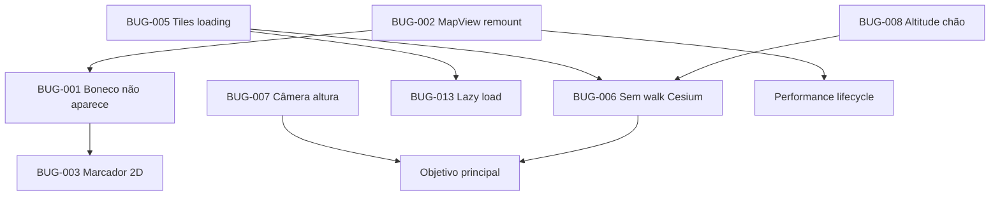

# DocitoMapas — Bugs e Soluções (Guia para Agente Desenvolvedor)

> **Documento operacional** · DocitoMapas · 2026-07-01  
> **Fonte de verdade de produto:** [`PROJETO.md`](../PROJETO.md)  
> **Documento relacionado (bug legado):** [`BUG-character-not-rendering.md`](./BUG-character-not-rendering.md)  
> **Status geral:** Aberto — MVP de animação 3D **incompleto**, especialmente no **modo fotorrealista**

---

## 1. Objetivo principal do sistema (o que o agente deve entregar)

Conforme [`PROJETO.md`](../PROJETO.md) §1, §7 e critérios de aceitação §13:

> Um usuário calcula a **ordem ótima das paradas**, entra no **modo cinema**, escolhe zoom **"Foto (3D)"** (Google Photorealistic 3D Tiles via Cesium) e vê um **boneco 3D andando** ao longo da `fullGeometry` da rota otimizada, com **câmera em 3ª pessoa próxima** (altura aproximada da cabeça do personagem, ~1,65 m) e **liberdade para orbitar/mover a câmera** enquanto o boneco segue a trajetória — simulando caminhar pela cidade na vida real.

### Definição de “pronto” (DoD — Definition of Done)

| # | Critério | RF |
|---|----------|-----|
| D1 | Boneco **visível e animado** (walk/run) percorrendo a polyline no modo cinema padrão (MapLibre) | RF-09 |
| D2 | Boneco **visível e animado** percorrendo a polyline no modo **Foto (3D)** (Cesium + Google 3D Tiles) | RF-09, RF-11 |
| D3 | Câmera **3ª pessoa orbitável** atrás/acima do boneco, distância ~3–8 m, altura ~olhos/cabeça | RF-12 |
| D4 | Play/pause/seek/velocidade funcionam **sem congelar** cena ou boneco | RF-10 |
| D5 | Transição planner → cinema **não destrói** o mapa desnecessariamente | RNF-01 |
| D6 | Fallback visual (marcador 2D) se WebGL/modelo 3D falhar | RF-09 (robustez) |

---

## 2. Arquitetura atual (referência rápida)

```
PlannerPage
  ├── MapView (instância A — planner)     ← desmontada ao entrar cinema
  └── MapView (instância B — cinema)      ← remontada do zero

MapView
  ├── MapLibre GL + CharacterLayer (Three.js)     → zoom street/neighborhood/city…
  ├── CesiumPhotorealisticView (lazy)             → zoomPreset === 'photorealistic'
  ├── RAF loop → interpolatePosition() → update boneco + câmera
  └── playerStore (cinema, progress, speed, cameraMode, zoomPreset)

CharacterLayer (MapLibre)
  ├── buildProceduralCharacter() + AnimationMixer (walk/run)
  └── GLB opcional: /models/character.glb

CesiumPhotorealisticView
  ├── Google Photorealistic 3D Tiles
  ├── installProceduralCandyCharacter() — estático, SEM animação
  └── ModelGraphics (GLB Mixamo) — estático, SEM AnimationMixer
```

### Arquivos-chave

| Arquivo | Papel |
|---------|-------|
| `apps/web/src/features/map/MapView.tsx` | Orquestração mapa, RAF, lifecycle boneco, switch MapLibre↔Cesium |
| `apps/web/src/features/map/CesiumPhotorealisticView.tsx` | Viewer Cesium, tiles Google, boneco Cesium, câmera orbit |
| `apps/web/src/features/character/CharacterLayer.ts` | Boneco Three.js no MapLibre (funcional com animação) |
| `apps/web/src/features/character/cesiumCandyCharacter.ts` | Boneco procedural Cesium (sem animação) |
| `apps/web/src/lib/geometry.ts` | `interpolatePosition()` — trajetória ao longo da rota |
| `apps/web/src/lib/cesiumCamera.ts` | `computeCinemaCamera()` — parâmetros compartilhados |
| `apps/web/src/pages/PlannerPage.tsx` | **Duas instâncias** de `<MapView />` |
| `apps/web/src/stores/playerStore.ts` | Estado cinema/player |
| `apps/web/public/models/README.md` | Instruções Mixamo — **nenhum .glb no repo** |

---

## 3. Catálogo de bugs

Legenda de prioridade:

- **P0** — Bloqueia o objetivo principal; corrigir primeiro
- **P1** — Degrada experiência core; corrigir na mesma sprint
- **P2** — UX/incorreto mas contornável
- **P3** — Melhoria / spec futura

---

### BUG-001 · P0 · Boneco não aparece no modo cinema (MapLibre)

**Sintoma:** Usuário entra no cinema, dá play, mapa e polyline visíveis, mas **nenhum boneco 3D** nem marcador rosa.

**Causa raiz (parcialmente corrigida):** Race condition entre `map.on('load')` e o `useEffect` que monta `CharacterLayer`. O código antigo usava `isLoadedRef` (ref) que não dispara re-render.

**Estado atual do código:** Foi aplicada correção parcial — `mapReady` como **state** + `styleEpoch` nas deps:

```413:449:apps/web/src/features/map/MapView.tsx
  useEffect(() => {
    const map = mapRef.current;
    if (!map || !mapReady || !route) return;
    // ...
  }, [cinema, route, mapReady, styleEpoch, usePhotorealistic]);
```

**Ainda pode falhar por:** BUG-002 (remontagem do MapView), BUG-003 (marcador escondido), zoom global (personagem sub-pixel).

**Solução:**

1. **Verificar** se o fix `mapReady` resolve em produção (checklist §8).
2. Se ainda falhar, aplicar **Opção B** do doc legado: chamar `ensureCharacterLayer()` diretamente em `onStyleReady` lendo estado via `usePlayerStore.getState()` / `useRouteStore.getState()`.
3. Garantir que `seedCharacterPosition()` roda após montar camada.

**Arquivos:** `MapView.tsx`  
**Commit sugerido:** `fix(web): ensure character layer mounts after map ready`  
**DoD:** D1, checklist item 1–3 em §8.

---

### BUG-002 · P0 · MapView remontado ao entrar/sair do cinema

**Sintoma:** Ao clicar "Assistir viagem em 3D", o mapa **recarrega do zero** (tiles, zoom, posição). Janela de timing aumenta; personagem pode demorar ou falhar.

**Causa raiz:**

```28:33:apps/web/src/pages/PlannerPage.tsx
  if (cinema) {
    return (
      <div className="fixed inset-0 z-50 flex flex-col bg-background">
        <div className="absolute inset-0">
          <MapView />
```

vs.

```123:124:apps/web/src/pages/PlannerPage.tsx
          <div className="relative h-[560px] overflow-hidden rounded-3xl border border-border bg-card shadow-candy">
            <MapView />
```

São **duas instâncias React distintas** — desmontagem completa do WebGL/contexto MapLibre.

**Solução (escolher uma):**

**Opção A (recomendada):** Elevar `<MapView />` para um único componente persistente:

```tsx
// PlannerPage.tsx — estrutura sugerida
<div className="relative min-h-screen">
  <MapView className={cinema ? 'fixed inset-0 z-0' : 'h-[560px] rounded-3xl ...'} />
  {cinema ? <CinemaOverlay /> : <PlannerLayout />}
</div>
```

**Opção B:** CSS fullscreen overlay sobre o mesmo mapa (sem conditional return com MapView diferente).

**Opção C:** Contexto React (`MapContext`) compartilhando `mapRef` entre modos (mais invasivo).

**Arquivos:** `PlannerPage.tsx`, possivelmente `MapView.tsx` (prop `className` / layout)  
**Commit sugerido:** `fix(web): keep single MapView instance across planner and cinema`  
**DoD:** D5 — entrar/sair cinema sem reload visível de tiles.

---

### BUG-003 · P1 · Marcador 2D não funciona como fallback

**Sintoma:** Quando o boneco 3D falha (ou em 1ª pessoa), o usuário **não vê** o ponto rosa de posição.

**Causa raiz:** Marcador só é exibido em modo `'free'`:

```596:597:apps/web/src/features/map/MapView.tsx
          el.style.display =
            !usePhotorealistic && cameraMode === 'free' ? 'block' : 'none';
```

O doc legado (`BUG-character-not-rendering.md`) prometia safety net **sempre visível** — não implementado.

**Solução:**

```ts
// Lógica sugerida
const showMarker =
  !usePhotorealistic &&
  (cameraMode === 'free' ||
    cameraMode === 'first-person' ||
    !characterLayerRef.current?.hasRendered); // expor flag no CharacterLayer

el.style.display = showMarker ? 'block' : 'none';
```

Alternativa mínima: mostrar marcador quando `!characterLayerRef.current` ou após timeout (ex.: 3 s sem log `1º render`).

**Arquivos:** `MapView.tsx`, opcionalmente `CharacterLayer.ts` (flag `didLogFirstRender` pública)  
**DoD:** D6.

---

### BUG-004 · P1 · Progresso zerado ao entrar no cinema

**Sintoma:** Toda vez que entra no cinema, animação reinicia do início.

**Causa:**

```67:67:apps/web/src/stores/playerStore.ts
  setCinema: (v) => set({ cinema: v, playing: false, progress: 0 }),
```

**Solução:** Só resetar `progress` ao **sair** do cinema ou explicitamente no botão "Reiniciar":

```ts
setCinema: (v) =>
  set((s) => ({
    cinema: v,
    playing: false,
    progress: v ? s.progress : 0, // mantém progresso ao entrar
  })),
```

**DoD:** Reentrar cinema mantém posição do boneco na rota.

---

### BUG-005 · P0 · Modo Foto (3D): boneco congelado enquanto tiles carregam

**Sintoma:** Usuário seleciona zoom "Foto (3D)", vê banner "Refinando Google 3D… 15–40 s", dá play — **nada se move** (boneco e câmera parados) por até 40 s.

**Causa raiz:** `syncFrame` retorna cedo se tiles não prontos:

```189:190:apps/web/src/features/map/CesiumPhotorealisticView.tsx
      if (!viewerReadyRef.current || !isViewerAlive(viewer)) return;
```

`viewerReadyRef.current = true` só após `createGooglePhotorealistic3DTileset` completar (~371).

**Solução (implementar todas):**

1. **Bloquear Play** enquanto `tilesLoading === true`:
   - Expor `isCesiumReady` via ref/callback de `CesiumPhotorealisticView` → `MapView` → `PlayerControls`.
   - Desabilitar botão Play + tooltip "Aguarde o Google 3D carregar".

2. **Fila de frames:** Armazenar último `CesiumFrameUpdate` e aplicar no primeiro frame após `viewerReadyRef = true`.

3. **Posicionar boneco antes dos tiles:** Separar `viewerReadyRef` em `viewerInitializedRef` (Viewer criado, boneco posicionável) vs `tilesReadyRef` (Google 3D carregado). `syncFrame` deve atualizar **personagem** mesmo com tiles carregando; câmera orbit pode esperar tiles.

**Arquivos:** `CesiumPhotorealisticView.tsx`, `MapView.tsx`, `PlayerControls.tsx`  
**DoD:** D2, D4 — play só habilitado quando cena pronta; seek funciona durante loading.

---

### BUG-006 · P0 · Modo Foto (3D): boneco desliza sem animação de caminhada

**Sintoma:** No Cesium, o personagem **teleporta/desliza** ao longo da rota como objeto rígido — sem movimento de pernas/braços. Experiência não simula "caminhar pela cidade".

**Causa raiz:**

- `cesiumCandyCharacter.ts` — primitivas estáticas (ellipsoid/cylinder), sem keyframes.
- `ModelGraphics` no Cesium — GLB carregado **sem** `ModelAnimationCollection` / sem mixer.
- MapLibre `CharacterLayer` **tem** `AnimationMixer` — mas é **removido** quando `usePhotorealistic === true`.

**Solução (escolher abordagem, preferência em ordem):**

**Opção A — Animação procedural Cesium (rápida, sem asset):**
- Animar pernas/braços candy via `CallbackProperty` ou `SampledProperty` (oscilação senoidal sincronizada com `speed` e `playing`).
- Arquivo: `cesiumCandyCharacter.ts` — adicionar `updateWalkAnimation(viewer, dt, motion)`.

**Opção B — GLB animado no Cesium (ideal com Mixamo):**
- Usar `ModelGraphics` com clipes embutidos no GLB.
- Cesium suporta animações via `entity.model.uri` + `ModelAnimationLoop` (ver docs Cesium `ModelAnimation`).
- Adicionar `character.glb` com clip `walk` em `public/models/`.
- Sincronizar `model.activeAnimations` com `deriveCharacterMotion()`.

**Opção C — Manter Three.js sobre Cesium (complexo):**
- Não recomendado na v1 — conflito WebGL.

**Passos concretos (Opção B):**

1. Adicionar `character.glb` Mixamo (walk + idle) conforme `public/models/README.md`.
2. Em `CesiumPhotorealisticView`, após carregar model:
   ```ts
   entity.model = new ModelGraphics({
     uri: modelUrl,
     runAnimations: new ConstantProperty(true),
     // ...
   });
   ```
3. Passar `motion` (`idle|walk|run`) do RAF para `syncFrame` e ajustar `multiplier` da animação.
4. Para procedural candy, implementar Opção A como fallback.

**Arquivos:** `CesiumPhotorealisticView.tsx`, `cesiumCandyCharacter.ts`, `MapView.tsx` (passar `motion` no `syncFrame`), `public/models/character.glb`  
**DoD:** D2 — pernas se movem visivelmente durante play em modo Foto (3D).

---

### BUG-007 · P0 · Câmera 3ª pessoa não está na altura da cabeça / distância errada

**Sintoma:** No modo fotorrealista, câmera orbita o boneco mas parece **muito longe**, **muito alta** ou **não colada** ao personagem — não simula "acompanhar de perto na altura dos olhos".

**Causa raiz:**

1. `computeCinemaCamera` calcula `cesiumRangeMeters` (ex.: 36 m em 3ª pessoa) mas **nunca é aplicado** — Cesium usa `trackedEntity` com defaults.
2. `behindDistance = 28` m em photorealistic — longe demais para experiência "próximo".
3. `applyCesiumCamera` **retorna cedo** para `third-person`:

```503:503:apps/web/src/features/map/CesiumPhotorealisticView.tsx
  if (cameraMode === 'free' || cameraMode === 'third-person') return;
```

4. Altura da câmera orbit Cesium não é configurada para ~1,65 m (altura dos olhos).

**Solução (alinhada ao PROJETO.md §7.3 — "third-person atrás do boneco"):**

1. **Configurar `viewer.trackedEntity` com offset customizado:**
   ```ts
   import { Cartesian3, HeadingPitchRange } from 'cesium';

   // Offset: atrás do boneco, altura olhos (~1.65m), distância 4-6m
   viewer.trackedEntity = character;
   viewer.zoomTo(character, new HeadingPitchRange(
     CesiumMath.toRadians(pos.heading + 180), // atrás
     CesiumMath.toRadians(-15),                 // leve inclinação para baixo (olhos)
     5.0                                        // distância em metros
   ));
   ```

2. **Atualizar offset a cada frame** (ou usar `EntityView` / `setView` com `Transform` local) para câmera seguir heading da rota.

3. **Ajustar constantes** em `cesiumCamera.ts`:
   ```ts
   // photorealistic third-person
   behindDistance: 5   // era 28
   eyeHeightMeters: 1.65
   cesiumRangeMeters: 5 // aplicar de fato
   ```

4. **Implementar `applyCesiumThirdPersonCamera(viewer, pos, cam)`** chamado em `syncFrame` mesmo quando `usesOrbitCamera` — configurar distância/altura antes de `requestRender`.

5. **Liberdade de orbit:** Manter `enableRotate/enableZoom` no `screenSpaceCameraController` — usuário pode orbitar livremente; ao soltar, câmera **retorna suavemente** ao offset padrão (opcional: spring lerp).

**Arquivos:** `CesiumPhotorealisticView.tsx`, `cesiumCamera.ts`  
**DoD:** D3 — câmera ~5 m atrás, ~1,65 m altura, orbitável com scroll/drag.

---

### BUG-008 · P1 · Boneco Cesium afundado ou flutuando nos Google 3D Tiles

**Sintoma:** Personagem aparece **metade enterrado** no chão ou **flutuando** acima da calçada nos prédios 3D.

**Causa:**

```148:148:apps/web/src/features/map/CesiumPhotorealisticView.tsx
  charPosRef.setValue(Cartesian3.fromDegrees(pos.lng, pos.lat, 0));
```

- Altitude fixa `0` ignora elevação do terreno/tiles.
- `HeightReference.CLAMP_TO_GROUND` no GLB pode conflitar com posição manual.
- MapLibre usa `CHARACTER_ALTITUDE_M = 0.8` — inconsistência entre engines.

**Solução:**

1. Usar `viewer.scene.sampleHeightMostDetailed(cartographic)` ou `clampToHeightMostDetailed` para obter elevação real nos tiles Google.
2. Cache de elevação por segmento da rota (amortizar custo).
3. Offset vertical: `groundHeight + 0.05` (pés no chão) para candy; `groundHeight` para origem do modelo GLB.
4. Fallback: `heightReference: HeightReference.RELATIVE_TO_GROUND` com `height: 0`.

**Arquivos:** `CesiumPhotorealisticView.tsx`, novo helper `lib/cesiumTerrain.ts`  
**DoD:** Boneco com pés na calçada visível em modo Foto (3D).

---

### BUG-009 · P1 · Modo `'free'` no Cesium não é câmera livre

**Sintoma:** Usuário seleciona câmera "Livre" no modo Foto (3D) — recebe **orbit tracked** igual a 3ª pessoa.

**Causa:**

```83:85:apps/web/src/features/map/CesiumPhotorealisticView.tsx
function usesOrbitCamera(mode: CameraMode): boolean {
  return mode === 'third-person' || mode === 'free';
}
```

Bloco `if (mode === 'free')` em `applyCesiumCameraMode` (linhas 128–134) é **código morto**.

**Solução:**

```ts
function usesOrbitCamera(mode: CameraMode): boolean {
  return mode === 'third-person'; // free NÃO usa orbit
}
```

Para `'free'`: `viewer.trackedEntity = undefined`, habilitar translate + rotate + zoom, câmera não segue boneco automaticamente (espelhar comportamento MapLibre).

**Arquivos:** `CesiumPhotorealisticView.tsx`  
**DoD:** Modo Livre permite pan/zoom/rotate independente do boneco.

---

### BUG-010 · P2 · Badge "Modo doce / Mixamo" incorreto no modo Foto (3D)

**Sintoma:** Badge sempre mostra "Modo doce" em photorealistic, mesmo com GLB carregado no Cesium.

**Causa:** Badge lê `CharacterLayer.isUsingGltf`, mas essa camada é **removida** em photorealistic.

**Solução:**

1. Expor estado do modelo Cesium via callback/ref: `onCharacterVisualChange('procedural' | 'gltf')`.
2. Ou mover badge para dentro de `CesiumPhotorealisticView` quando `usePhotorealistic`.

**Arquivos:** `MapView.tsx`, `CesiumPhotorealisticView.tsx`  
**DoD:** Badge reflete engine ativa.

---

### BUG-011 · P2 · Modos top-down/isometric forçados para 3ª pessoa no Foto (3D)

**Sintoma:** Usuário seleciona "Topo" ou "Isométrica" — sistema **muda sozinho** para 3ª pessoa.

**Causa:**

```235:241:apps/web/src/features/map/MapView.tsx
    if (mode === 'top-down' || mode === 'isometric') {
      setCameraMode('third-person');
    }
```

**Solução:** Remover override forçado OU documentar como limitação e desabilitar opções no `PlayerControls` quando `zoomPreset === 'photorealistic'` (preferível — evita estado inconsistente).

**Arquivos:** `MapView.tsx`, `PlayerControls.tsx`  
**DoD:** UI coerente — opções indisponíveis mostram tooltip explicativo.

---

### BUG-012 · P2 · CharacterLayer removido ao trocar para Foto (3D) sem transição suave

**Sintoma:** Ao mudar zoom para "Foto (3D)", boneco MapLibre **some instantaneamente**; delay até Cesium mostrar boneco.

**Causa:** `removeCharacterLayer` + lazy load Cesium + tiles loading.

**Solução:**

1. Pré-montar `CesiumPhotorealisticView` em background quando `cinema && hasGoogleMapsKey` (hidden).
2. Crossfade opacity MapLibre → Cesium.
3. BUG-005 fix (boneco posicionável antes dos tiles).

**DoD:** Transição sem "flash" de cena vazia.

---

### BUG-013 · P2 · Lazy load Cesium: frames perdidos no início

**Sintoma:** Primeiros segundos após selecionar Foto (3D), `cesiumRef.current?.syncFrame` é no-op.

**Causa:** `React.lazy` + `Suspense fallback={null}` — componente monta assincronamente.

**Solução:** Eager import quando `cinema === true` (prefetch no clique "Assistir viagem em 3D") ou `Suspense` com overlay "Iniciando motor 3D…".

**Arquivos:** `MapView.tsx`, `PlannerPage.tsx`  
**DoD:** Boneco posicionado na rota em ≤ 2 s após selecionar Foto (3D).

---

### BUG-014 · P3 · Sem animação "drive" para modos veículo

**Sintoma:** Em modo carro/caminhão, boneco **anda** em vez de simular direção.

**Causa:** `deriveCharacterMotion` retorna `'walk'|'run'|'idle'` para todos os modos.

**Solução:** Adicionar clip `drive` ou esconder boneco pedrestre e usar ícone veículo (fase futura). Baixa prioridade vs caminhada fotorrealista.

**Referência:** PROJETO.md §7.2 — `walk/run/drive`.

---

### BUG-015 · P3 · Sem GLB Mixamo no repositório

**Sintoma:** Sempre fallback procedural.

**Solução:** Seguir `apps/web/public/models/README.md` — adicionar `character.glb` ou documentar como passo manual do dev. Não bloqueia se procedural animado funcionar.

---

## 4. Epic: Trajetória ótima — sincronização rota ↔ animação

### BUG-016 · P2 · Velocidade da animação não reflete duração real por trecho

**Sintoma:** Boneco move-se a **velocidade espacial constante** ao longo da polyline; trechos urbanos lentos e rodovias rápidas têm mesma velocidade visual.

**Causa:** `progress += (dt / totalDurationSeconds) * speed` — correto para tempo total, mas `interpolatePosition` usa distância acumulada linearmente.

**Nota:** Comportamento **aceitável para MVP** se `totalDurationSeconds` vem do ORS. Melhoria futura: interpolar por tempo acumulado por leg.

**Solução (opcional v2):** Pré-computar `cumulativeDuration[]` por vértice usando `RouteLeg.durationSeconds`.

---

### BUG-017 · P3 · Heading abrupto em curvas fechadas

**Sintoma:** Boneco "gira seco" em esquinas.

**Solução:** Suavizar heading com `lerpAngle(prevHeading, nextHeading, 0.15)` no RAF.

**Arquivo:** `geometry.ts` ou `MapView.tsx` step loop.

---

## 5. Ordem de implementação recomendada

Ordem para maximizar valor em direção ao objetivo principal (boneco andando no modo realista com câmera 3ª pessoa):

| Sprint | Bugs | Entrega |
|--------|------|---------|
| **S1 — Desbloquear base** | BUG-001 (verificar), BUG-002, BUG-003, BUG-004 | Boneco visível e persistente no cinema MapLibre |
| **S2 — Modo realista funcional** | BUG-005, BUG-013, BUG-008 | Cesium carrega, play bloqueado até pronto, boneco no chão |
| **S3 — Experiência imersiva (core)** | BUG-006, BUG-007 | Animação walk + câmera 3ª pessoa na altura da cabeça orbitável |
| **S4 — Polimento** | BUG-009, BUG-010, BUG-011, BUG-012 | UX câmera, badges, transições |
| **S5 — Nice-to-have** | BUG-014, BUG-015, BUG-016, BUG-017 | Drive mode, GLB, suavização |

---

## 6. Especificação técnica: câmera 3ª pessoa orbitável (meta do produto)

Implementação alvo para o agente (modo Foto 3D):

```
Parâmetros:
  distância atrás:     4–6 m   (configurável, default 5)
  altura olhos:        1.65 m  (relativa ao chão amostrado)
  pitch inicial:       -10° a -20° (olhando levemente para baixo no boneco)
  bearing:             heading da rota + 180° (câmera atrás)
  liberdade usuário:   rotate (orbit), zoom (3–15 m), tilt limitado
  retorno suave:       opcional — lerp para offset padrão ao soltar mouse

Fluxo por frame (syncFrame):
  1. pos = interpolatePosition(...)
  2. groundH = sampleHeight(pos)           // BUG-008
  3. updateCharacter(pos, groundH, motion) // BUG-006
  4. if cameraMode === 'third-person':
       applyThirdPersonCamera(viewer, pos, groundH, userOrbitDelta)
  5. requestRender()
```

Referência PROJETO.md:

> RF-12: Câmera com modos: third-person (atrás do boneco)  
> §7.3: Fotorrealista — zoom 20, pitch 75°, Cesium + Google 3D Tiles

---

## 7. Checklist de verificação (QA manual)

| # | Passo | Esperado | Bug se falhar |
|---|-------|----------|---------------|
| 1 | Calcular rota → cinema (zoom Rua, 3ª pessoa) → play | Boneco candy visível, animando, segue polyline | BUG-001, BUG-002 |
| 2 | Console: `[DocitoMapas][character] 1º render` | Aparece em ≤ 2 s | BUG-001 |
| 3 | `?debug=character` | Octaedro rosa grande | BUG-001 |
| 4 | Seek no slider (pausado) | Boneco reposiciona | — |
| 5 | Zoom → Foto (3D) | Banner loading; play desabilitado até pronto | BUG-005 |
| 6 | Tiles carregados → play | Boneco **anda** com animação de pernas | BUG-006 |
| 7 | 3ª pessoa Foto (3D) | Câmera ~5 m atrás, altura olhos, orbitável | BUG-007 |
| 8 | Boneco em ladeira/rua 3D | Pés no chão, não flutuando | BUG-008 |
| 9 | Câmera → Livre (Foto 3D) | Pan independente do boneco | BUG-009 |
| 10 | Sair/voltar cinema | Mapa não recarrega do zero | BUG-002 |
| 11 | Exportar vídeo (Foto 3D) | MP4/WebM com boneco visível | — |

---

## 8. Convenções para o agente implementador

- Consultar [`PROJETO.md`](../PROJETO.md) antes de novas dependências.
- **Escopo mínimo:** corrigir bugs listados; não refatorar arquitetura inteira.
- Não commitar chaves API (`VITE_GOOGLE_MAPS_API_KEY`, `ORS_API_KEY`).
- Commits: Conventional Commits (`fix(web): …`, `feat(web): …`).
- Tipos TS estritos; testes unitários para helpers novos em `lib/`.
- Atualizar status deste doc e [`BUG-character-not-rendering.md`](./BUG-character-not-rendering.md) ao fechar bugs.
- PR: vídeo screen recording modo Foto (3D) + checklist §7.

### Variáveis de ambiente necessárias

| Variável | Onde | Para quê |
|----------|------|----------|
| `ORS_API_KEY` | `apps/api/.env` | Rota otimizada |
| `VITE_GOOGLE_MAPS_API_KEY` | `apps/web/.env` | Modo Foto (3D) |

---

## 9. Mapa de dependências entre bugs



---

## 10. Status de correções já aplicadas (baseline 2026-07-01)

| Item | Status | Notas |
|------|--------|-------|
| `isLoadedRef` → `mapReady` state | ✅ Aplicado | Verificar eficácia — BUG-001 |
| `styleEpoch` para remount após `setStyle` | ✅ Aplicado | P1 doc legado |
| `ensureCharacterLayer` idempotente | ✅ Aplicado | — |
| Animação walk MapLibre (Three.js) | ✅ Funcional | Procedural + mixer |
| Cesium Google 3D Tiles | ✅ Parcial | Carrega, mas UX incompleta |
| Animação walk Cesium | ✅ Aplicado | candy procedural + runAnimations GLB |
| Câmera 3ª pessoa altura olhos | ✅ Aplicado | viewFrom + 5 m |
| MapView instância única | ✅ Aplicado | BUG-002 |
| Marcador 2D fallback | ✅ Aplicado | BUG-003 |
| Progresso preservado ao entrar cinema | ✅ Aplicado | BUG-004 |
| Cesium: boneco antes dos tiles + play bloqueado | ✅ Aplicado | BUG-005 |
| Animação walk Cesium (candy + GLB) | ✅ Aplicado | BUG-006 |
| Câmera 3ª pessoa ~5 m / 1,65 m | ✅ Aplicado | BUG-007 |
| Altitude amostrada nos tiles Google | ✅ Aplicado | BUG-008 |
| Modo Livre independente no Cesium | ✅ Aplicado | BUG-009 |
| Badge Mixamo no modo Foto (3D) | ✅ Aplicado | BUG-010 |
| UI topo/isométrica desabilitada no 3D | ✅ Aplicado | BUG-011 |
| Cesium eager import (sem lazy) | ✅ Aplicado | BUG-013 |

---

*Documento gerado a partir de análise estática de `PROJETO.md` e código-fonte em 2026-07-01. Atualizar seção §10 conforme bugs forem fechados.*
